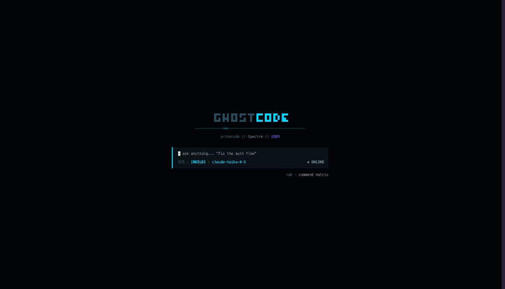
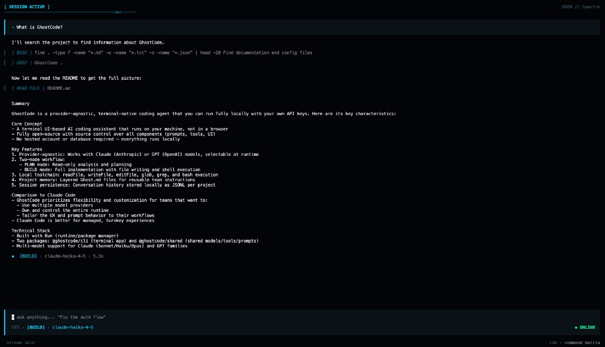
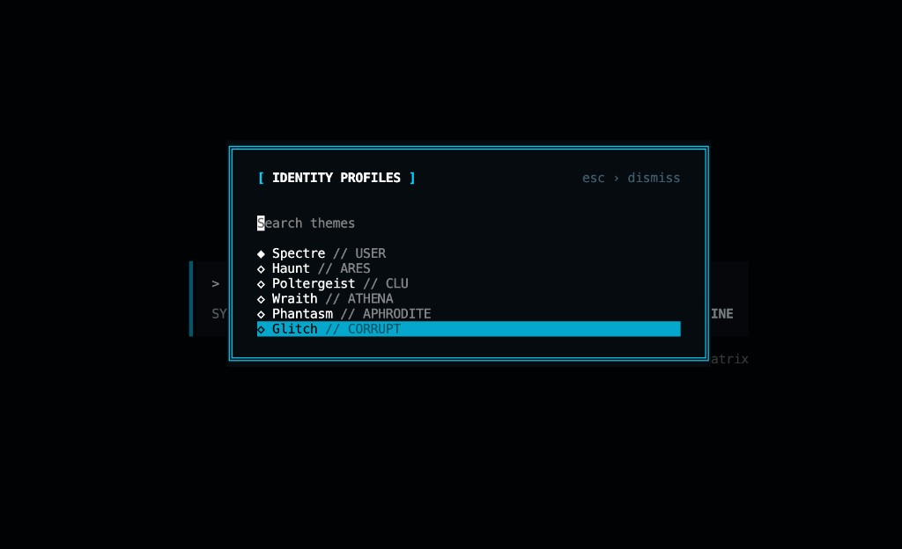
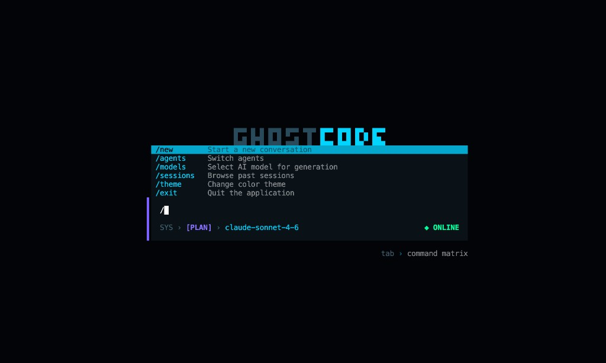

# GhostCode

> **Your provider-agnostic terminal coding harness.** Own the loop — models, tools, memory, and UI.

GhostCode is a local-first coding harness you run in your terminal with your own API keys. No hosted account stack, no vendor lock-in on models.

The harness gives you a focused TUI, explicit PLAN/BUILD control, local tool execution, project memory, and persistent session history — all in one place you control.

## Why this harness

- **Provider-agnostic by design**: swap Anthropic and OpenAI models at runtime.
- **Runs in your terminal**: no browser tab context-switching.
- **Local-first runtime**: no server or database dependency in the harness loop.
- **Safer edit loop**: PLAN mode for analysis, BUILD mode for implementation.
- **Project memory**: layered `Ghost.md` loading for reusable team instructions.
- **Session persistence**: every conversation stored per-project as JSONL.

## GhostCode vs Claude Code (quick view)

GhostCode is not trying to clone Claude Code. It is a harness you can shape — prompts, tools, config layers, and TUI chrome:

- **Model flexibility**: Claude and GPT from one harness.
- **Own the runtime**: full source control over prompts, tools, and UI.
- **Config layering**: project, team, and local settings with deterministic precedence.
- **Customizable UX**: themed HUD-style TUI and command/dialog system.

If you prefer a managed turnkey experience, Claude Code is strong. If you want a harness you own and can extend, GhostCode is the better fit.

## Screenshots

### Launch Screen



### Session View (Markdown + Tooling)



### Theme Picker



### Command Palette



## Harness capabilities

- **Terminal UI**: full-screen, keyboard-driven chat interface.
- **PLAN / BUILD modes**: read-only planning or full file/shell execution.
- **Local toolchain**: `readFile`, `writeFile`, `editFile`, `glob`, `grep`, `bash`.
- **Multi-model support**: Claude Sonnet/Haiku/Opus and GPT-5.4 family.
- **Prompt memory**: global + project + local memory file merging.
- **Session store**: append-only transcripts under `~/.ghostcode/projects/`.

## Architecture

| Package | Purpose |
| --- | --- |
| `ghostcode-cli` | Harness runtime — TUI, tools, sessions (`ghostcode` binary) |
| `@ghostcode/shared` | Harness contracts — models, tool schemas, system prompts |

## Prerequisites

- [Bun](https://bun.sh)
- Anthropic and/or OpenAI API key

## Use As Installed CLI

Once published, install the harness globally:

```bash
npm install -g ghostcode-cli
# or
bun install -g ghostcode-cli
```

Then, from any project folder:

```bash
cd /path/to/your-project
ghostcode
```

Recommended first-run setup:

```bash
export ANTHROPIC_API_KEY=sk-ant-...
export OPENAI_API_KEY=sk-proj-...
ghostcode
```

## Quick Start

### 1) Install

```bash
bun install
```

### 2) Configure keys

```bash
export ANTHROPIC_API_KEY=sk-ant-...
export OPENAI_API_KEY=sk-proj-...
```

Or copy [`.env.example`](.env.example) to `.env` in the project where you run `ghostcode`.

### 3) Run

```bash
bun run dev:cli
```

Global link:

```bash
bun run link:cli
ghostcode
```

Run via bin in local source mode:

```bash
GHOSTCODE_DEV=1 ghostcode
# or
bun run --filter ghostcode-cli dev:bin
```

## Configuration & Storage

### Runtime store

```text
~/.ghostcode/
  settings.json
  Ghost.md
  projects/
    Users-me-my-app/
      <session-id>.jsonl
```

### Project-level files

```text
my-app/
  Ghost.md
  Ghost.local.md
  .ghostcode/
    settings.json
    settings.local.json
    preferences.json
```

Theme precedence:
`settings.local.json` -> `.ghostcode/preferences.json` -> `settings.json` -> `~/.ghostcode/preferences.json` -> `~/.ghostcode/settings.json`

Profiles:
`Spectre`, `Haunt`, `Poltergeist`, `Wraith`, `Phantasm`, `Glitch`

Recommended `.gitignore` entries:

```text
Ghost.local.md
.ghostcode/settings.local.json
```

## Commands

| Script | Description |
| --- | --- |
| `bun run dev:cli` | Run CLI with file watch |
| `bun run build:cli` | Build CLI into `packages/cli/dist` |
| `bun run link:cli` | Link `ghostcode` globally |
| `bun run pack:cli` | Generate npm tarball for CLI |
| `bun run release:check` | Build + pack release artifact |
| `bun run publish:cli` | Publish `ghostcode-cli` via Bun |

## Modes

| Mode | Tools |
| --- | --- |
| `PLAN` | `readFile`, `listDirectory`, `glob`, `grep` |
| `BUILD` | PLAN + `writeFile`, `editFile`, `bash` |

## Environment Variables

| Variable | Description |
| --- | --- |
| `ANTHROPIC_API_KEY` | Required for Claude models |
| `OPENAI_API_KEY` | Required for GPT models |
| `GHOSTCODE_CONFIG_DIR` | Override default `~/.ghostcode` path |
| `GHOSTCODE_DEV` | Force bin to run source (`src`) entry |
