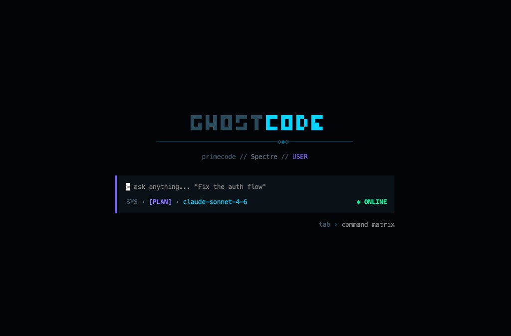
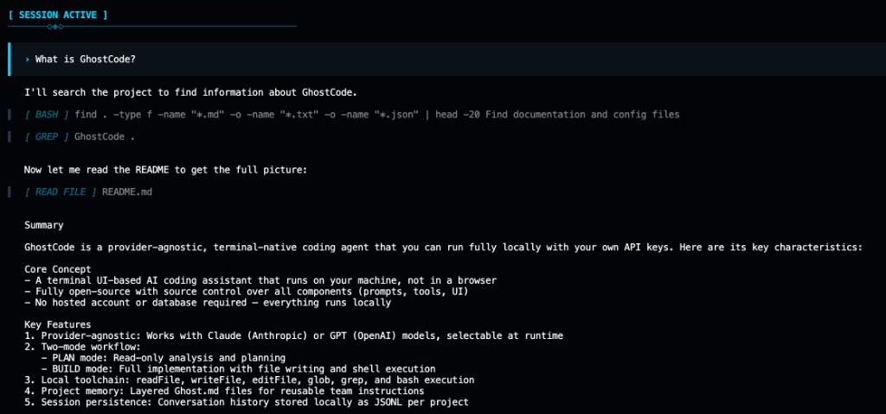

# GhostCode CLI

> **Your provider-agnostic terminal coding harness.**

GhostCode CLI is the harness runtime: a local-first loop for planning, building, and shipping in your repo — with Anthropic or OpenAI models and your own API keys.

## Install

```bash
npm install -g ghostcode-cli
```

or

```bash
bun install -g ghostcode-cli
```

## Run

From your project directory:

```bash
ghostcode
```

## Quick usage

```bash
# Open the harness TUI
ghostcode

# Set provider keys (one or both)
export ANTHROPIC_API_KEY=sk-ant-...
export OPENAI_API_KEY=sk-proj-...
```

Inside the harness:

- `tab` — toggle PLAN/BUILD mode
- `/models` — switch model
- `/theme` — switch UI profile
- `/sessions` — resume previous chats

## Screenshots

### Launch



### Session



### Theme Picker


### Command Palette


## Environment variables

- `ANTHROPIC_API_KEY` — Claude models
- `OPENAI_API_KEY` — GPT models
- `GHOSTCODE_CONFIG_DIR` — override default config path (`~/.ghostcode`)

## Harness highlights

- Full-screen terminal UI
- PLAN/BUILD modes
- Local file + shell tools
- Session persistence per project
- Project memory via `Ghost.md`

For full product docs, architecture, and contributor setup, see the repository root [README.md](../../README.md).
